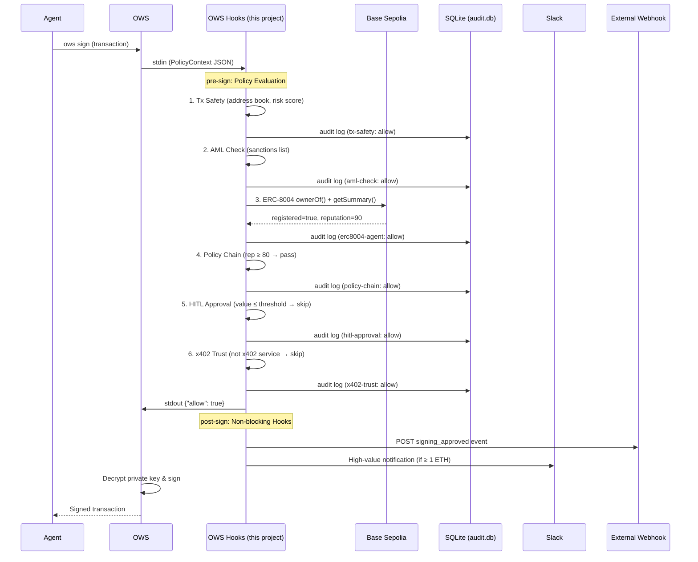
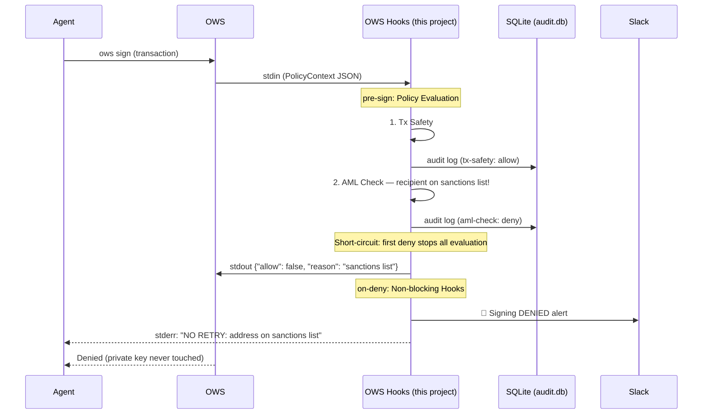
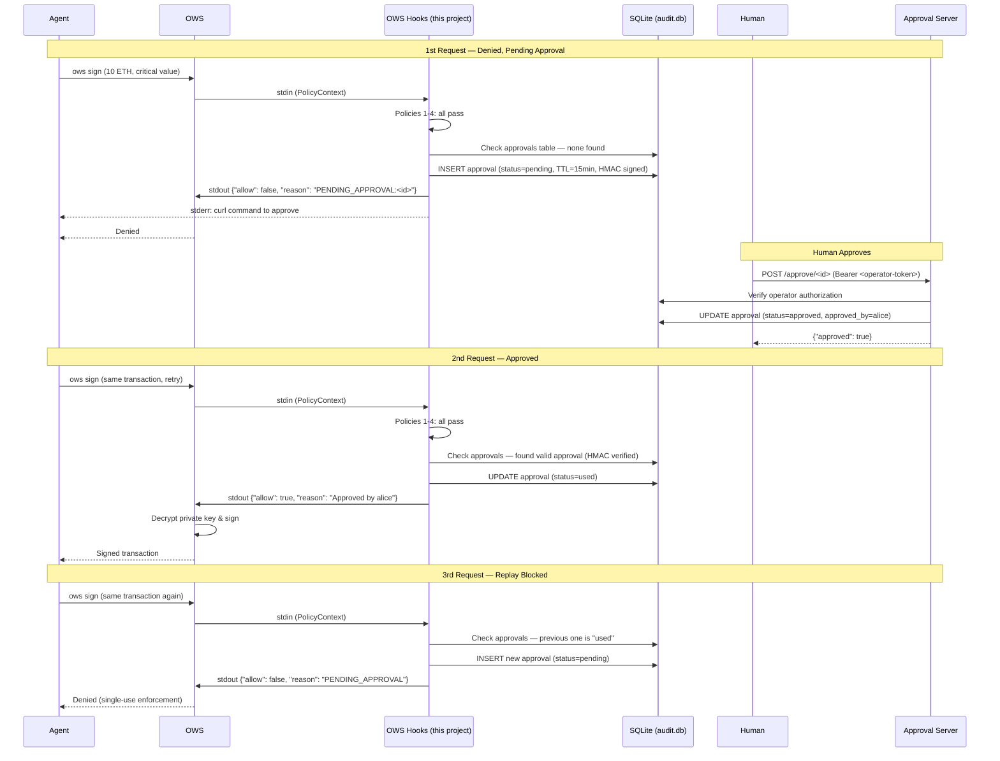

# OWS Hooks

> OWS Hackathon 2026-04-03

A signing hooks framework for the Open Wallet Standard. Evaluates AI agent signing requests in real time using policy chains, on-chain identity verification, and human-in-the-loop approval.

**AI agents get hacked. Prompt injection hijacks them. But OWS Hooks doesn't use an LLM — it can't be tricked. It runs in an independent process, sees no prompts, no context. That's Zero Trust for Agents.**

## Challenges Addressed

| Challenge | How |
|-----------|-----|
| **#04 Agent identity attestation** | Live ERC-8004 Identity Registry verification on Base Sepolia — unregistered agents are blocked |
| **#01 Open Trust Standard** | Policy Chaining uses ERC-8004 reputation to dynamically adjust rules — same tx, different outcome based on trust |
| **#08 On-chain audit log** | Append-only SQLite audit log with tamper-proof triggers; extensible to on-chain Merkle Root |
| **#02 Agent intent verification** | Every signing request passes through AML/identity/HITL checks before the private key is ever decrypted |

## Architecture

```
Agent → OWS (ows sign) → OWS Hooks (pre-sign)
                              │
                              ├── 1. Tx Safety (address book, risk score, poisoning detection)
                              ├── 2. AML Check (sanctions list)
                              ├── 3. ERC-8004 Agent ID (on-chain identity + reputation)
                              ├── 4. Policy Chaining (dynamic rules based on upstream results)
                              ├── 5. HITL Approval (human-in-the-loop for critical transactions)
                              └── 6. x402 Trust (service trust scores)
                              │
                              ├── Audit Log (SQLite, append-only)
                              ├── post-sign hooks (notifications, external audit)
                              └── on-deny hooks (alerts, retry guidance, HITL notifications)
```

Policy evaluation runs **before signing, before private key decryption**. If denied, the key is never touched. The agent cannot bypass this flow.

## Hooks Framework

| Hook | Status | Description |
|------|--------|-------------|
| **pre-sign** | ✅ Implemented | Policy evaluation chain — KYC/AML, ERC-8004, Policy Chaining, HITL Approval |
| **post-sign** | ✅ Implemented | Webhook notifications, Slack alerts for high-value transactions |
| **on-deny** | ✅ Implemented | Alert webhooks, Slack alerts, retry guidance, HITL approval instructions |

### Sequence: Allow Flow



### Sequence: Deny Flow



### Sequence: HITL Approval Flow



## Policies

| Policy | Type | Description |
|--------|------|-------------|
| **Tx Safety** | Data-driven | Address book whitelist, risk scoring, address poisoning detection |
| **AML Check** | Mock | Checks recipient against sanctions lists |
| **ERC-8004 Agent ID** | On-chain | Verifies agent registration and reputation in ERC-8004 Identity Registry |
| **Policy Chaining** | Dynamic | Dynamically adjusts rules based on upstream policy results |
| **HITL Approval** | Polling | Human-in-the-loop approval for critical-value transactions |
| **x402 Trust** | Data-driven | Trust score verification for x402 service payments |

### Policy Chaining Behavior

```
ERC-8004 reputation >= 80 → High-value transfers allowed (up to critical threshold)
ERC-8004 reputation 50-79 → Low-value only, high-value (>1 ETH) blocked
ERC-8004 reputation < 50  → All transfers blocked (caught by ERC-8004 policy first)
```

### Human-in-the-Loop Approval

Critical-value transactions (>5 ETH by default) require explicit human approval, regardless of agent reputation.

```
1st request:  Agent → Hooks → critical value detected → DENY (PENDING_APPROVAL)
                                                       → on-deny hook prints approval command
Human:        Approves via CLI or approval-server API
2nd request:  Agent → Hooks → approval found → ALLOW (marks approval as used)
3rd request:  Agent → Hooks → approval already used → DENY (new approval required)
```

#### HITL Security Concerns

| Threat | Severity | Mitigation | Status |
|--------|----------|------------|--------|
| Approval replay | **HIGH** | tx_hash binds to exact (to, value, chain_id). Single-use. | Implemented |
| Unauthenticated approval API | **HIGH** | Operator Bearer token (`HITL_OPERATOR_TOKEN`) required for `/pending` and `/approve/:id` | Implemented |
| TTL too long | **MEDIUM** | Default 15 min, configurable via HITL_APPROVAL_TTL_MINUTES | Implemented |
| Slack/channel token leak | **MEDIUM** | Channel access = approval access. Restrict channel membership. | Known limitation |
| No approver identity verification | **MEDIUM** | approved_by field is self-reported, not cryptographically verified | Known limitation |
| Infinite retry by agent | **LOW** | Max 3 retries per approval, then auto-expired | Implemented |
| DB tampering | **LOW** | Append-only trigger on approvals table, HMAC integrity check | Implemented |
| No multi-party approval (M-of-N) | **LOW** | Single approver only | Known limitation |

#### HITL Known Limitations and Future Work

- **No native OWS `pending` state**: OWS only supports `allow`/`deny`. HITL returns `deny` with a `PENDING_APPROVAL` reason. The agent must implement retry logic. A native `pending` state with callback URL would be a cleaner solution — this requires an OWS spec change.
- **Approver identity**: The `approved_by` field is self-reported. In production, integrate with an identity provider (OAuth, SAML) or require cryptographic signatures from approvers.
- **Multi-party approval**: Only one approver is needed. For high-risk scenarios, M-of-N threshold approval (e.g., 2 of 3 approvers) would add security.
- **No TLS on approval server**: The approval HTTP server has no built-in TLS. In production, place behind a reverse proxy (nginx, Caddy) with TLS termination.
- **No rate limiting**: The approval server has no rate limiting. In production, add rate limiting to prevent brute-force token guessing.

## Security: Zero Trust for Agents

| Threat | Mitigation |
|--------|-----------|
| Prompt injection | Hooks run in OWS process, not agent's. Agent cannot bypass. |
| PolicyContext tampering | Context is generated by OWS core, not the agent. |
| Policy config tampering | Config files are outside agent's API key scope. |
| Timeout exploit | Deny-by-default: timeout (5s) or error → always Deny. |
| Audit log tampering | SQLite triggers prohibit DELETE/UPDATE (append-only). |
| Approval forgery | Operator Bearer auth + HMAC integrity checks on approvals. |

## Configuration

Policies and hooks are configured via `ows-hooks.json` in the project root. This file controls which policies run, in what order, and which hooks fire on allow/deny.

```jsonc
// ows-hooks.json
{
  "pre-sign": [
    "tx-safety",
    "aml-check",
    "erc8004-agent",
    "policy-chain",
    "hitl-approval",
    "x402-trust"
  ],
  "post-sign": [
    "stderr-log",
    "external-audit",
    "slack-notify"
  ],
  "on-deny": [
    "stderr-log",
    "retry-guidance",
    "alert-webhook",
    "slack-alert"
  ]
}
```

- **`pre-sign`** — Policy hooks evaluated before signing. Array order = evaluation order. First deny short-circuits.
- **`post-sign`** — Hooks that fire after an approved signing (non-blocking).
- **`on-deny`** — Hooks that fire after a denied signing (non-blocking).
- If `ows-hooks.json` is absent, all hooks run in the default order.

### Available Policies

| Name | Description |
|------|-------------|
| `tx-safety` | Address book whitelist, risk scoring, address poisoning detection |
| `kyc-check` | KYC verification (mock) — not in default pipeline, add to `pre-sign` to enable |
| `aml-check` | Sanctions list check (mock) |
| `erc8004-agent` | ERC-8004 agent identity and reputation (on-chain) |
| `policy-chain` | Dynamic rules based on upstream policy results |
| `hitl-approval` | Human-in-the-loop approval for critical transactions |
| `x402-trust` | Trust score verification for x402 service payments |

### Available Hooks

| Name | Type | Description |
|------|------|-------------|
| `stderr-log` | post-sign / on-deny | Print summary to stderr |
| `external-audit` | post-sign | POST signing event to webhook |
| `slack-notify` | post-sign | Slack notification for high-value tx |
| `retry-guidance` | on-deny | Print retry hints to stderr |
| `alert-webhook` | on-deny | POST denial event to webhook |
| `slack-alert` | on-deny | Slack alert for denied tx |

## Setup

```bash
npm install
npm run build
npm test
```

## Register with OWS

```bash
ows policy create --file ows-policy.json
ows key create --name "my-agent" --wallet <wallet-name> --policy ows-hooks
```

## Demo

```bash
# Run all scenarios with colored output
bash demo/run-demo.sh
```

Demo scenarios:
1. **All Clear** — All policies pass → Allow
2. **High-Risk Address** — Risk score too high → Deny
3. **AML Block** — Sanctions list hit → Deny
4. **Policy Chain: Mid Rep + High Value** — Reputation 60, 2 ETH → Deny
5. **Policy Chain: High Rep + High Value** — Reputation 90, 2 ETH → Allow
6. **Address Poisoning** — Similar address to trusted entry → Deny
7. **HITL: Critical Value** — 10 ETH → DENY → Human approves → Retry → ALLOW → Replay blocked

## Approval Server

For production HITL flows, run the approval server as a separate process:

```bash
# Start the approval server
HITL_HMAC_SECRET=your-strong-secret HITL_OPERATOR_TOKEN=your-operator-token node dist/approval-server.js

# List pending approvals
curl -H "Authorization: Bearer your-operator-token" http://localhost:3001/pending

# Approve a request
curl -X POST http://localhost:3001/approve/<id> \
  -H "Authorization: Bearer your-operator-token" \
  -H "Content-Type: application/json" \
  -d '{"approved_by": "alice"}'
```

Or use the CLI:

```bash
HITL_OPERATOR_TOKEN=your-operator-token bash scripts/approve.sh <approval_id> alice
```

## Environment Variables

| Variable | Description | Default |
|----------|-------------|---------|
| `ERC8004_MOCK` | Use mock ERC-8004 instead of on-chain | `false` |
| `ERC8004_IDENTITY_REGISTRY` | ERC-8004 Identity Registry address | Base Sepolia default |
| `ERC8004_REPUTATION_REGISTRY` | ERC-8004 Reputation Registry address | Base Sepolia default |
| `ERC8004_MIN_REPUTATION` | Minimum reputation to pass | `50` |
| `BASE_SEPOLIA_RPC_URL` | Base Sepolia RPC endpoint | `https://sepolia.base.org` |
| `OWS_PP_AUDIT_DB` | Audit/approval database path | `./audit.db` |
| `HITL_HMAC_SECRET` | HMAC secret for approval integrity/tokens (required) | — |
| `HITL_OPERATOR_TOKEN` | Bearer token for approval-server operator endpoints (required) | — |
| `HITL_APPROVAL_TTL_MINUTES` | Approval expiry time | `15` |
| `HITL_VALUE_THRESHOLD` | Value threshold for HITL (wei) | `1000000000000000000` (1 ETH) |
| `HITL_CRITICAL_THRESHOLD` | Critical value threshold (wei) | `5000000000000000000` (5 ETH) |
| `APPROVAL_SERVER_PORT` | Approval server port | `3001` |
| `SLACK_WEBHOOK_URL` | Slack webhook for notifications | — |
| `POST_SIGN_WEBHOOK_URL` | Webhook for post-sign events | — |
| `ON_DENY_WEBHOOK_URL` | Webhook for on-deny events | — |

## Future Extensions

- **On-chain Merkle Root**: Periodically write Merkle Root of audit log entries on-chain. Any log entry becomes provable via Merkle Proof — tamper-evident audit trail at minimal cost (1 tx/day).
- **Real KYC/AML APIs**: Replace mock with Chainalysis, Elliptic, Circle, Sumsub, or your own compliance API.
- **Policy Ecosystem**: Developers publish custom policies as npm packages. Install and register with one command.

## Tech Stack

- TypeScript / Node.js
- OWS v1.2.0 (executable policy)
- better-sqlite3 (audit log + approval store)
- viem (ERC-8004 on-chain queries)
- Vitest (testing)
